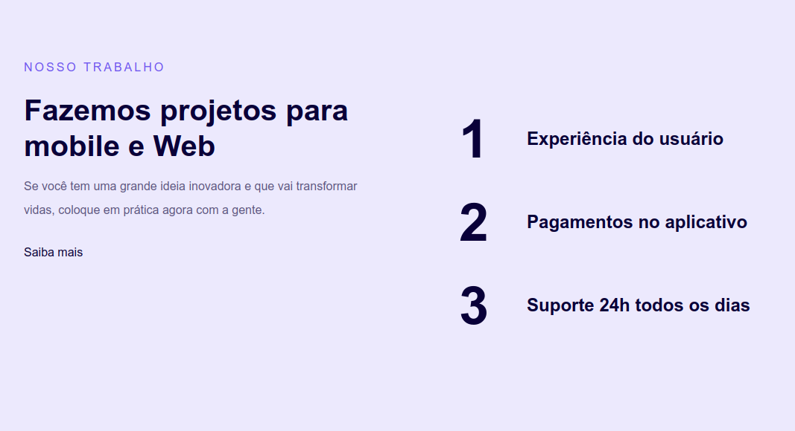

# Introduction to Responsiveness

This project is a simple web application that demonstrates responsive design principles for both mobile and web projects.



## Table of Contents

- [Overview](#overview)
- [Technologies Used](#technologies-used)
- [Installation](#installation)
- [Usage](#usage)
- [Contributing](#contributing)
- [License](#license)
- [Contact](#contact)

## Overview

The goal of this project is to provide an example of how to create a responsive web application that looks great on both mobile devices and desktops. The application showcases a landing page with information about the services provided, highlighting user experience, in-app payments, and 24/7 support.

## Technologies Used

- HTML5
- CSS3

## Installation

To run this project locally, follow the steps below:

1. Clone the repository:

    ```bash
    git clone https://github.com/your-username/repository-name.git
    ```

2. Navigate to the project directory:

    ```bash
    cd repository-name
    ```

3. Open the `index.html` file in your browser.

## Usage

To use the application, simply open the `index.html` file in your browser. You will see a responsive landing page with a brief introduction and list of services.

### Project Structure

- `index.html`: Main structure of the application.
- `style.css`: Styles used for the application.

### Example of Usage

1. Open `index.html` in your browser.
2. Explore the responsive design by resizing your browser window to see how the layout adjusts.
